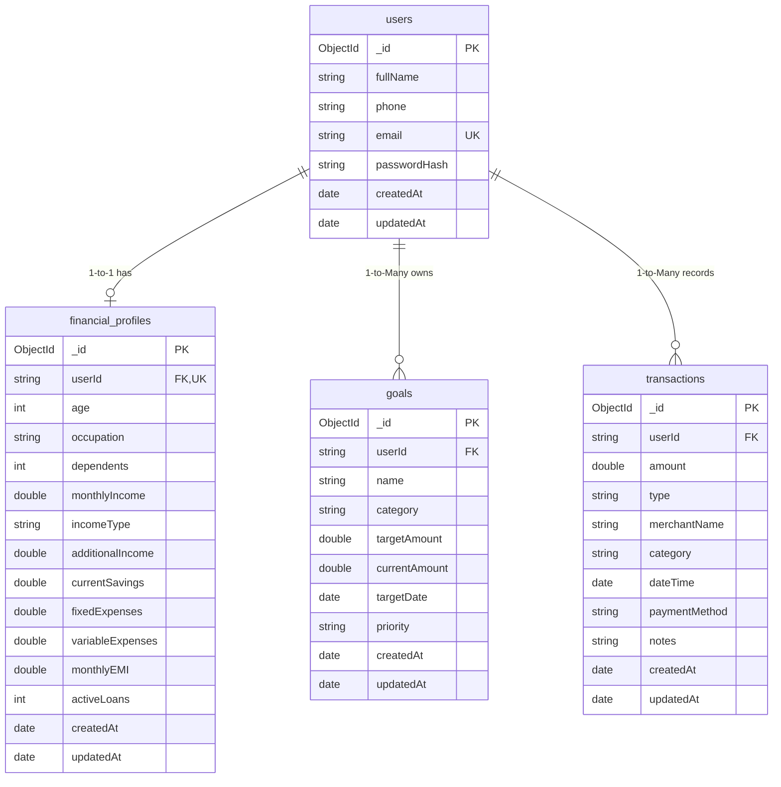

# GoalSync — MongoDB Atlas Database Architecture & Setup Guide

This document defines the complete MongoDB Atlas database design, collection structures, indexing strategy, security standards, and FastAPI backend schema contract for the **GoalSync** application.

---

## 1. MongoDB Atlas Setup Steps

### Step 1: Create Account & Organization
1. Go to [MongoDB Atlas](https://www.mongodb.com/cloud/atlas) and sign up or log in.
2. In the organization view, click **New Project** and name it `GoalSync`.

### Step 2: Deploy Cluster
1. Click **Create** to deploy a new database.
2. Choose **M0 (Free Tier / Shared)** for development or **M10+** for production.
3. Select a cloud provider and region closest to your target users (e.g., AWS `ap-south-1` Mumbai).
4. Name your cluster (e.g., `goalsync-cluster`).
5. Click **Create Cluster**.

### Step 3: Configure Database User Security
1. Navigate to **Security** → **Database Access**.
2. Click **Add New Database User**.
3. Authentication Method: **Password** (SCRAM-SHA-256).
4. Username: e.g., `goalsync_app_user`.
5. Autogenerate or create a strong password (save it temporarily in a secure password manager).
6. Under **Database User Privileges**, select **Built-in Role** → **Read and write to any database** (or restrict to `goalsync` database with `readWrite@goalsync`).
7. Click **Add User**.

> [!IMPORTANT]
> Never use admin or root credentials for application services. Keep credentials strictly in environment variables.

### Step 4: Configure Network Access (IP Whitelist)
1. Navigate to **Security** → **Network Access**.
2. Click **Add IP Address**.
3. For local development:
   - Choose **Add Current IP Address** to allow your current machine, OR
   - Choose **Allow Access from Anywhere** (`0.0.0.0/0`) if your IP is dynamic or testing across machines with strong password authentication.
4. For production deployment:
   - Restrict to the static IP addresses of your backend deployment server (e.g., Render, Railway, AWS ECS/EC2).
5. Click **Confirm**.

### Step 5: Obtain Connection String
1. Under **Deployment** → **Database**, click **Connect** on your cluster.
2. Select **Drivers** (Python / Motor).
3. Copy the SRV connection URI:
   ```text
   mongodb+srv://<username>:<password>@goalsync-cluster.xxxxx.mongodb.net/?retryWrites=true&w=majority&appName=GoalSync
   ```
4. Replace `<username>` and `<password>` with your database user credentials.
5. In your connection string or settings, specify the database name: `goalsync`.

---

## 2. Recommended Database & Collection Structure

- **Database Name**: `goalsync`
- **Collections**:
  1. `users`
  2. `financial_profiles`
  3. `goals`
  4. `transactions`

All user-specific documents contain a `userId` field linking back to `users._id`. Timestamps (`createdAt`, `updatedAt`) are stored as UTC BSON Date objects (`ISODate`).



---

### Collection 1: `users`
Stores authenticated user accounts.

| Field | BSON / Mongo Type | Description | Constraints |
| :--- | :--- | :--- | :--- |
| `_id` | `ObjectId` or `string` | Unique document identifier | Primary Key |
| `fullName` | `string` | Full name of user | Required, trimmed |
| `phone` | `string` | User phone number | Required, unique index recommended |
| `email` | `string` | User email address | Required, unique, lowercased |
| `passwordHash` | `string` | Salted password hash | Required (bcrypt / Argon2id) |
| `createdAt` | `date` | Timestamp created | Required |
| `updatedAt` | `date` | Timestamp last modified | Required |

> [!CAUTION]
> Plain-text passwords must never be persisted in MongoDB Atlas or transferred unhashed.

---

### Collection 2: `financial_profiles`
Captures the financial position of each user (1-to-1 relationship with `users`).

| Field | BSON / Mongo Type | Description | Constraints | Flutter Model Alignment |
| :--- | :--- | :--- | :--- | :--- |
| `_id` | `ObjectId` or `string` | Unique document identifier | Primary Key | N/A |
| `userId` | `string` / `ObjectId` | User document ID reference | Required, Unique | `userId` |
| `age` | `int` | Age of the user | Required, `>= 18` | `age` |
| `occupation` | `string` | User profession | Required | `occupation` |
| `dependents` | `int` | Number of financial dependents | Required, `>= 0` | `dependents` |
| `monthlyIncome` | `double` | Primary monthly income | Required, `>= 0` | `monthlyIncome` |
| `incomeType` | `string` | Source type (`Salary`, `Business`, `Freelance`, `Other`) | Required | `incomeType` |
| `additionalIncome` | `double` | Side hustle/investment income | Default `0.0`, `>= 0` | `additionalIncome` |
| `currentSavings` | `double` | Total liquid savings | Required, `>= 0` | `currentSavings` |
| `fixedExpenses` | `double` | Rent, utilities, necessities | Required, `>= 0` | Flutter `monthlyFixedExpenses` |
| `variableExpenses` | `double` | Food, entertainment, etc. | Required, `>= 0` | Flutter `monthlyVariableExpenses` |
| `monthlyEMI` | `double` | Total current EMI outflow | Required, `>= 0` | Flutter `existingLoanEmi` |
| `activeLoans` | `int` | Number of active loan accounts | Required, `>= 0` | Flutter `activeLoansCount` |
| `createdAt` | `date` | Record creation timestamp | Required | `completedAt` |
| `updatedAt` | `date` | Record update timestamp | Required | N/A |

---

### Collection 3: `goals`
Tracks financial milestones and goals for users (1-to-many relationship with `users`).

| Field | BSON / Mongo Type | Description | Allowed Values / Constraints |
| :--- | :--- | :--- | :--- |
| `_id` | `ObjectId` or `string` | Unique document identifier | Primary Key |
| `userId` | `string` / `ObjectId` | User reference | Required, Indexed |
| `name` | `string` | Name of the goal | Required, 1-100 chars |
| `category` | `string` | Goal category enum | `'education'`, `'travel'`, `'vehicle'`, `'home'`, `'emergencyFund'`, `'investment'`, `'personal'`, `'other'` |
| `targetAmount` | `double` | Target amount in currency | Required, `> 0` |
| `currentAmount` | `double` | Saved amount so far | Required, `>= 0`, `<= targetAmount` |
| `targetDate` | `date` | Target deadline | Required, future date |
| `priority` | `string` | Goal priority enum | `'essential'`, `'important'`, `'flexible'` |
| `createdAt` | `date` | Created timestamp | Required |
| `updatedAt` | `date` | Updated timestamp | Required |

---

### Collection 4: `transactions`
Records user financial inflow and outflow (1-to-many relationship with `users`).

| Field | BSON / Mongo Type | Description | Allowed Values / Constraints |
| :--- | :--- | :--- | :--- |
| `_id` | `ObjectId` or `string` | Unique document identifier | Primary Key |
| `userId` | `string` / `ObjectId` | User reference | Required, Indexed |
| `amount` | `double` | Transaction amount | Required, `> 0` |
| `type` | `string` | Outflow or Inflow | `'debit'`, `'credit'` |
| `merchantName` | `string` | Payee/Payer name | Required, non-empty |
| `category` | `string` | Spending category | `'Food & Dining'`, `'Shopping'`, `'Groceries'`, `'Bills & Utilities'`, `'Entertainment'`, `'Transport'`, `'Health & Medical'`, `'Investment'`, `'Salary & Income'`, `'Transfer'`, `'Education'`, `'Other'` |
| `dateTime` | `date` | Date & time of transaction | Required |
| `paymentMethod` | `string` | Payment channel enum | `'upi'`, `'card'`, `'netBanking'`, `'cash'`, `'other'` |
| `notes` | `string` / `null` | Optional memo | Optional, nullable |
| `createdAt` | `date` | Record created timestamp | Required |
| `updatedAt` | `date` | Record updated timestamp | Required |

---

## 3. Required Indexes

Run the following commands in the **Atlas Mongo Shell (`mongosh`)** or via backend migration script:

```javascript
// Connect to the database
use goalsync;

// ==========================================
// 1. users Collection Indexes
// ==========================================
// Unique index on email (case-insensitive collation or lowercased entries)
db.users.createIndex(
  { email: 1 },
  { unique: true, name: "idx_users_email_unique" }
);

// Unique index on phone number (sparse in case users register with email only)
db.users.createIndex(
  { phone: 1 },
  { unique: true, sparse: true, name: "idx_users_phone_unique" }
);

// ==========================================
// 2. financial_profiles Collection Indexes
// ==========================================
// Enforce 1-to-1 relationship between user and financial profile
db.financial_profiles.createIndex(
  { userId: 1 },
  { unique: true, name: "idx_financial_profiles_userId_unique" }
);

// ==========================================
// 3. goals Collection Indexes
// ==========================================
// Index for fast query of goals by user
db.goals.createIndex(
  { userId: 1 },
  { name: "idx_goals_userId" }
);

// Compound index for user goals ordered by creation date
db.goals.createIndex(
  { userId: 1, createdAt: -1 },
  { name: "idx_goals_userId_createdAt" }
);

// Compound index for user goals sorted by target deadline
db.goals.createIndex(
  { userId: 1, targetDate: 1 },
  { name: "idx_goals_userId_targetDate" }
);

// ==========================================
// 4. transactions Collection Indexes
// ==========================================
// Primary user lookup index
db.transactions.createIndex(
  { userId: 1 },
  { name: "idx_transactions_userId" }
);

// Compound index for user transactions sorted newest first (critical for timeline)
db.transactions.createIndex(
  { userId: 1, dateTime: -1 },
  { name: "idx_transactions_userId_dateTime" }
);

// Compound index for calculating debit/credit totals and cash flow
db.transactions.createIndex(
  { userId: 1, type: 1, dateTime: -1 },
  { name: "idx_transactions_userId_type_dateTime" }
);

// Compound index for expense categorization aggregation
db.transactions.createIndex(
  { userId: 1, category: 1 },
  { name: "idx_transactions_userId_category" }
);
```

---

## 4. FastAPI Backend Connection Standard

The future FastAPI backend should connect to MongoDB Atlas asynchronously using **Motor** (`motor.motor_asyncio.AsyncIOMotorClient`).

### Connection Format
```text
mongodb+srv://<DB_USERNAME>:<DB_PASSWORD>@<CLUSTER_HOSTNAME>/?retryWrites=true&w=majority&appName=GoalSync
```

### Recommended FastAPI Database Client Implementation

```python
# app/core/database.py
from motor.motor_asyncio import AsyncIOMotorClient, AsyncIOMotorDatabase
from pydantic_settings import BaseSettings
from functools import lru_cache

class Settings(BaseSettings):
    MONGODB_URL: str
    MONGODB_DB_NAME: str = "goalsync"
    MONGODB_MIN_POOL_SIZE: int = 10
    MONGODB_MAX_POOL_SIZE: int = 50
    MONGODB_TIMEOUT_MS: int = 5000

    class Config:
        env_file = ".env"
        extra = "ignore"

@lru_cache()
def get_settings() -> Settings:
    return Settings()

class DatabaseManager:
    client: AsyncIOMotorClient = None
    db: AsyncIOMotorDatabase = None

db_manager = DatabaseManager()

async def connect_to_mongo():
    settings = get_settings()
    db_manager.client = AsyncIOMotorClient(
        settings.MONGODB_URL,
        minPoolSize=settings.MONGODB_MIN_POOL_SIZE,
        maxPoolSize=settings.MONGODB_MAX_POOL_SIZE,
        serverSelectionTimeoutMS=settings.MONGODB_TIMEOUT_MS,
    )
    db_manager.db = db_manager.client[settings.MONGODB_DB_NAME]

async def close_mongo_connection():
    if db_manager.client is not None:
        db_manager.client.close()

def get_database() -> AsyncIOMotorDatabase:
    return db_manager.db
```

---

## 5. Environment Template (`.env.example`)

A safe `.env.example` has been placed in the repository:

```env
# Application Environment
ENVIRONMENT=development
DEBUG=True
APP_NAME=GoalSync-API
API_V1_STR=/api/v1

# MongoDB Atlas Configuration
MONGODB_URL=mongodb+srv://<DB_USERNAME>:<DB_PASSWORD>@cluster0.xxxxx.mongodb.net/?retryWrites=true&w=majority
MONGODB_DB_NAME=goalsync

# Connection Pool Settings
MONGODB_MIN_POOL_SIZE=10
MONGODB_MAX_POOL_SIZE=50
MONGODB_TIMEOUT_MS=5000

# Authentication & JWT Security
JWT_SECRET_KEY=your_jwt_secret_key_here_change_in_production
JWT_ALGORITHM=HS256
ACCESS_TOKEN_EXPIRE_MINUTES=1440

# CORS Allowed Origins
ALLOWED_ORIGINS=http://localhost:3000,http://127.0.0.1:3000
```

---

## 6. Schema Contract for FastAPI Backend (Pydantic v2)

Share this schema specification with your backend engineer so the FastAPI models match both MongoDB Atlas and the GoalSync Flutter app.

```python
# app/schemas/contracts.py
from datetime import datetime
from enum import Enum
from typing import Optional
from pydantic import BaseModel, Field, EmailStr

# ==============================================================================
# ENUMS (Aligned with Flutter Models)
# ==============================================================================

class IncomeTypeEnum(str, Enum):
    SALARY = "Salary"
    BUSINESS = "Business"
    FREELANCE = "Freelance"
    OTHER = "Other"

class GoalCategoryEnum(str, Enum):
    EDUCATION = "education"
    TRAVEL = "travel"
    VEHICLE = "vehicle"
    HOME = "home"
    EMERGENCY_FUND = "emergencyFund"
    INVESTMENT = "investment"
    PERSONAL = "personal"
    OTHER = "other"

class GoalPriorityEnum(str, Enum):
    ESSENTIAL = "essential"
    IMPORTANT = "important"
    FLEXIBLE = "flexible"

class TransactionTypeEnum(str, Enum):
    DEBIT = "debit"
    CREDIT = "credit"

class PaymentMethodEnum(str, Enum):
    UPI = "upi"
    CARD = "card"
    NET_BANKING = "netBanking"
    CASH = "cash"
    OTHER = "other"

# ==============================================================================
# 1. USER CONTRACT
# ==============================================================================

class UserBase(BaseModel):
    fullName: str = Field(..., min_length=1, max_length=120)
    phone: str = Field(..., min_length=7, max_length=20)
    email: EmailStr

class UserCreate(UserBase):
    password: str = Field(..., min_length=6, max_length=128)

class UserInDB(UserBase):
    id: str = Field(..., alias="_id")
    passwordHash: str
    createdAt: datetime
    updatedAt: datetime

    class Config:
        populate_by_name = True

class UserResponse(UserBase):
    id: str = Field(..., alias="_id")
    createdAt: datetime
    updatedAt: datetime

    class Config:
        populate_by_name = True

# ==============================================================================
# 2. FINANCIAL PROFILE CONTRACT
# ==============================================================================

class FinancialProfileBase(BaseModel):
    age: int = Field(..., ge=18, le=120)
    occupation: str = Field(..., min_length=1)
    dependents: int = Field(0, ge=0)
    monthlyIncome: float = Field(..., ge=0.0)
    incomeType: str = "Salary"
    additionalIncome: float = Field(0.0, ge=0.0)
    currentSavings: float = Field(..., ge=0.0)
    fixedExpenses: float = Field(..., ge=0.0, alias="fixedExpenses")
    variableExpenses: float = Field(..., ge=0.0, alias="variableExpenses")
    monthlyEMI: float = Field(0.0, ge=0.0, alias="monthlyEMI")
    activeLoans: int = Field(0, ge=0, alias="activeLoans")

    class Config:
        populate_by_name = True

class FinancialProfileCreate(FinancialProfileBase):
    pass

class FinancialProfileInDB(FinancialProfileBase):
    id: str = Field(..., alias="_id")
    userId: str
    createdAt: datetime
    updatedAt: datetime

    class Config:
        populate_by_name = True

# ==============================================================================
# 3. GOAL CONTRACT
# ==============================================================================

class GoalBase(BaseModel):
    name: str = Field(..., min_length=1, max_length=100)
    category: GoalCategoryEnum
    targetAmount: float = Field(..., gt=0.0)
    currentAmount: float = Field(0.0, ge=0.0)
    targetDate: datetime
    priority: GoalPriorityEnum

class GoalCreate(GoalBase):
    pass

class GoalUpdate(BaseModel):
    name: Optional[str] = Field(None, min_length=1, max_length=100)
    category: Optional[GoalCategoryEnum] = None
    targetAmount: Optional[float] = Field(None, gt=0.0)
    currentAmount: Optional[float] = Field(None, ge=0.0)
    targetDate: Optional[datetime] = None
    priority: Optional[GoalPriorityEnum] = None

class GoalInDB(GoalBase):
    id: str = Field(..., alias="_id")
    userId: str
    createdAt: datetime
    updatedAt: datetime

    class Config:
        populate_by_name = True

# ==============================================================================
# 4. TRANSACTION CONTRACT
# ==============================================================================

class TransactionBase(BaseModel):
    amount: float = Field(..., gt=0.0)
    type: TransactionTypeEnum
    merchantName: str = Field(..., min_length=1, max_length=120)
    category: str = Field(..., min_length=1, max_length=60)
    dateTime: datetime
    paymentMethod: PaymentMethodEnum
    notes: Optional[str] = Field(None, max_length=500)

class TransactionCreate(TransactionBase):
    pass

class TransactionUpdate(BaseModel):
    amount: Optional[float] = Field(None, gt=0.0)
    type: Optional[TransactionTypeEnum] = None
    merchantName: Optional[str] = Field(None, min_length=1, max_length=120)
    category: Optional[str] = Field(None, min_length=1, max_length=60)
    dateTime: Optional[datetime] = None
    paymentMethod: Optional[PaymentMethodEnum] = None
    notes: Optional[str] = Field(None, max_length=500)

class TransactionInDB(TransactionBase):
    id: str = Field(..., alias="_id")
    userId: str
    createdAt: datetime
    updatedAt: datetime

    class Config:
        populate_by_name = True
```
